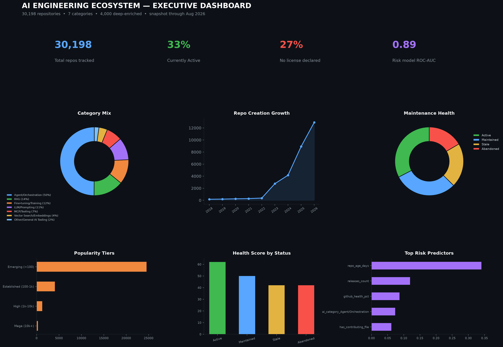

# The AI Engineering Ecosystem: Mapping 30,198 GitHub Repos

A portfolio data analysis project mapping the modern AI engineering open-source ecosystem — agent frameworks, RAG pipelines, fine-tuning tools, LLM prompting libraries, MCP tooling, and vector search engines — and building a machine learning model that flags which repositories are structurally at risk of going stale.

**By Zohair Baloch** — [Kaggle](https://www.kaggle.com/zohairbaloch) · [GitHub](https://github.com/zohairbaloch-64) · [LinkedIn](https://www.linkedin.com/in/zohair-baloch-data-analyst)

---

## Overview

This project analyzes 30,198 AI-related GitHub repositories to answer four questions:

- Which categories of AI tooling dominate open-source activity, and how fast is the space growing?
- What does a structurally "healthy" AI repo look like — documentation, licensing, release discipline?
- Can a repo's risk of going stale or abandoned be predicted from signals that exist *before* it shows visible inactivity?
- How much better than a naive guess is that prediction, honestly?

The notebook follows the **PACE framework** (Plan → Analyze → Construct → Execute) and closes with a one-page executive dashboard.

## Key Findings

- **Agent/Orchestration tooling makes up exactly half the ecosystem** (15,071 / 30,198 repos) — the single dominant category, not one slice among equals.
- **Sustained acceleration, not a one-time spike:** new repo creation grew from 365 (2022) → 2,756 (2023) → 4,158 (2024) → 8,918 (2025) → 12,924 in a partial 2026.
- **More than a third of tracked repos have gone quiet** (Stale + Abandoned combined) — evaluating "is this repo still alive" is a routine, recurring task for anyone picking a dependency.
- **27% of repos declare no license at all** — a more universal adoption blocker than staleness, and worth checking independently of recency.
- Star counts are heavily right-skewed: median stars = **9**, mean = **560** — a handful of mega-projects (max 237,413 stars) pull the average far above what a typical repo looks like. 81% of repos sit in the "Emerging (<100 stars)" tier.
- Across the 4,000-repo deep-enriched subset, README files are nearly universal (~100%) but CONTRIBUTING guides and issue templates are rare — most maintainers document for *users*, not *contributors*.

## Sustainability Risk Model

A binary classifier flags repos likely to become **Stale or Abandoned**, trained only on structural signals available *before* visible inactivity (stars, forks, open issues, size, age, GitHub health score, documentation completeness, license, release cadence, category, language). `days_since_last_push` and `pushed_at` are deliberately excluded — `maintenance_status` is derived directly from that field, so including it would leak the label into its own predictor.

| Model | Accuracy | F1 (at-risk class) | ROC-AUC |
|---|---|---|---|
| Baseline (majority class) | 78.8% | 0.0% | — |
| Random Forest | 80.6% | 63.4% | 0.883 |
| **XGBoost** | **82.0%** | **65.8%** | **0.893** |

The baseline's 0% F1 on the at-risk class is the point, not a footnote: a model that only ever predicts "healthy" looks deceptively strong on accuracy (78.8%) while being useless for the actual question. Both real models trade a little accuracy for a large F1 gain on the class that matters.

**SHAP explainability** confirms the model learned sensible relationships — `repo_age_days` and `github_health_pct` dominate, with older, lower-health repos pushed toward "at risk," and documentation-presence flags contributing secondary support. This is framed as a triage signal for prioritizing manual review, not a certainty machine for any single repo.

## Executive Dashboard

The notebook closes with a one-page dashboard combining KPIs (total repos, % active, % unlicensed, model ROC-AUC), category mix, growth trend, maintenance health, popularity tiers, health-by-status, and top risk predictors.



## Dataset

- **Source:** `ai_engineering_ecosystem_intelligence.csv` — 30,198 rows × 37 columns
- **Coverage:** repos created 2009–2026 (snapshot captured August 2026)
- **Deep enrichment:** GitHub health score, documentation-file flags, and release cadence are populated for 4,000 repos (13.2%); the risk model is trained and evaluated on this subset only

## Tech Stack

`pandas` · `numpy` · `matplotlib` · `scikit-learn` · `XGBoost` · `SHAP`

## Repository Structure

```
├── AI_Engineering_Ecosystem_Intelligence.ipynb   # Full analysis notebook
├── ai_engineering_ecosystem_intelligence.csv     # Dataset
├── README.md
└── assets/
    ├── cover_banner.png
    └── executive_dashboard.png
```

## Notebook Structure

1. **Plan** — business questions, audience, constraints
2. **Analyze: Data Overview & Quality** — nulls, dtypes, what's measurable at scale
3. **Analyze: Ecosystem Landscape** — categories, languages, popularity, growth, licensing, leaderboard
4. **Analyze: The Deep-Enriched Subset** — health scores, documentation presence, health vs. maintenance status
5. **Construct: Sustainability Risk Model** — baseline, Random Forest, XGBoost, SHAP
6. **Execute: Executive Dashboard**
7. **Key Findings & Recommendations**

---

